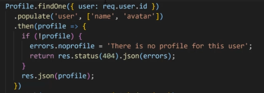
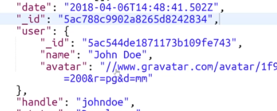
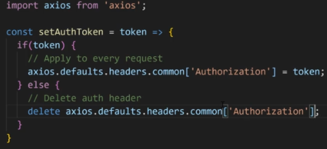

- In data schema we can add reference to another collection. The `user` field will contain the fields of the `user` collection.
    ```Javascript
    new Schema({
        user: {
            type: Schema.Types.ObjectId,
            ref: 'users'
        },
        ...
    })
    ```
- We can populate info from the referenced schema like this.
    
- This is how the output will come out as.
    
- Using Routers in react (to link to other pages), in App.js, wrap everything with <Router> tags.
    ```javascript
    <Router>
        <AppNavbar />
        <Route exact path="/" component={Landing} />
        <Route exact path="/login" component={Login} />
        <Footer />
    </Router>
    ```
- Using links in react
    ```javascript
    import { Link } from 'react-router-dom';

    //in render method
    <Link to="/register"> Register </Link>
    ```
- To have conditional class names we can use `classnames` package. the first parameter contains the default classes, those which will always be there and then the `is-invalid` class will be there only if `errors.name` exists.
    ```javascript
    className={classnames("mb-3", {
        'is-invalid': errors.name
    })}
    ```
- To redirect from action, we send `history` prop from the component from which we are calling the action. And from the action you gotta do `history.push('/newpage')`
- Else you can also do `history.push('/newpage')` from component lifecycle method `componentDidMount` if the reducer returns anything, like check for `isAuthenticated` and then redirect. This way you dont need to add any `withRouter` stuff to the component export line.
- If you wanna set private routes and not just redirect from every action/component, create and use PrivateRoute component. `<Switch><PrivateRoute exact path="/dashboard" component={UserLanding} /></Switch>` Switch is used to avoid some redirect issues. And Private route is a component you create which is basically a if condition to either render or redirect. In my project I have private routes for all places where only logged in user access and I just did history.push() where loggedin user is not supposed to be, like sigin/register page.
- Instead of always setting the auth header for each api (or creating a func of our own for doing that) we can use axios directly.
    
- To modularize the code, we can create a component for a form-group (password/text/email etc) and send it props like type="password". This will reduce a lot of html/css.
- **React components automatically re-render whenever there is a change in their state or props**
- To format dates in react we can do the following after running `npm install moment moment-react --save`
    ```javascript
    import Moment from 'react-moment';

    [...]

    <Moment formar="DD/MM/YYYY"> {theDate} </Moment>
    ```
- To get stuff from params in component, e.g if route is `/profile/handle/:handle` we can get the `:handle` by `this.props.match.params.handle`