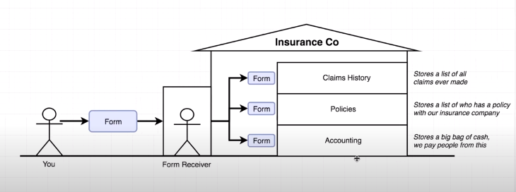
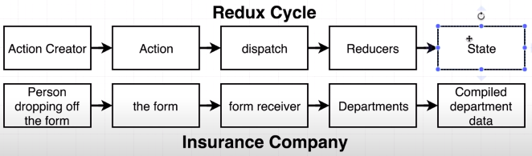

# Redux

Following [traversy](https://www.youtube.com/watch?v=93p3LxR9xfM&ab_channel=TraversyMedia).

- A state manager, creates application-level state instead of component level state for each state. This creates a one way data flow instead of all the flow of data back and forth in a tree.
- `npm install react react-redux redux-thunk`
- In App.js file `import { Provider } from 'react-redux'`.  Wrap everything in App component in `<Provider store={store}> </Provider>` tags.
- If you get react stricpt is not recognised kind of error, just run `npm install` again.
- Although you could have a `store` in the main file created with `createStore`(see docs). Better to create a file called store.js. Then in it, import createStore, applyMiddleware from redux. Also import thunk. Export the created store from this file.
- Create a folder in source called `reducers` in it create `index.js`. Import this guy in store file.
- In index.js we import combineReducers from redux. This file will combine all reducers and export it. in reducers folder, create others reducers for each action like postReducer.
- We create a actions folder in src folder and it contains a types.js that simply lists our action types, fetch and post. And we also create a postAction.js file. The function exported from postAction when called automatically calls dispatch.
- In our post component, we pass the store to props map function, which sends the redux store as a prop. Also we send the postAction as a prop, which we call and get the results from store. Also set up prop types for these 2 props.
- Install **Redux DevTools** chrome extension. We need to implement it into our application. In store.js file, import compose from 'redux'. Wrap apply appluMiddleware in compose, because we want multiple enhancers here, and add `window.__REDUX_DEVTOOLS_EXTENSION__ && window.__REDUX_DEVTOOLS_EXTENSIO__()`. In devtools, redux tab, you see what actions are being called and whats in store.

