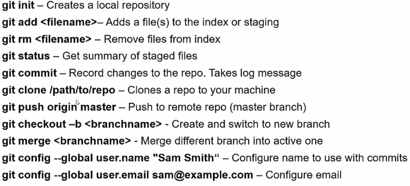

## The Full Stack Web Development Course: Others

### 1. Markdown
- `.md` or `.markdown`. Plain text that can be rendered nice and turned to html unlike RTF or HTML. Some extended markdowns(markdown extra, multi-markdown and the pandoc markdown extension) are light weight extensions to markdown and add features like tables, footnotes etc.
- Markdown [cheatsheet](/2.\ Markdown\ Basic\ Syntax/cheatsheet.md) and for [tables](/3.\ Task\ List\ &\ Tables/client_list.md)
- Can export md file as html in certain editors. Some editors can render markdown well, or can be done online.
- Markdown with nodejs with [marked](https://github.com/markedjs/marked) module.
    - install marked module
    - use is as such: 
    ```javascript
    var marked = require('marked'); 
    var html = marked('I am __Aisha__');

    //load md from file and render in html
    var app = express();
    app.get('/', function(req, res){
        var path = __dirname + '/markdown/index.md';
        var file = fs.readFile(path, 'utf8', function(err, data){
            if(err){
                console.log(err);
            }
            res.send(marked(data.toString()));
        });
    });
	});
    ```

### 2. Sass
- `Syntactically Awesome StyleSheets` sass is a css preprocessor that extends css and we can write "code" in one language and compile it in css. File extensions are `.sass` and `.scss`. Others are 'less' and 'Stylus'.
- Make sure to link your css file in html. Browser wont know what to do with scss file.
- We can have 
    - variables: `$bg:blue;`
    - nesting:
        ```scss
        .container{
            padding: 0px;
            ul{
                background-color: $bg
                li{
                    color: white
                }
            }
        }
        ```
    - partials: import one scss in another. Partials filename have to start with a `_`. Import by `// _myscss.scss` at the top of the other scss file. Or `@import 'myscss.scss'; `
    - mixins: bunch of css declarations that we can run at once. We can pass parameters, its kinda like a **function**. You wanna put your mixins in a partial.
        ```scss
        @mixin border-radius($radius){
            border-radius: $radius;
            -moz-border-radius: $radius;
        }

        .box{
            // other styles
            @include border-radius(20px);
        }
        ```
    - extend and inherit styles. 
        ```scss
        .container{
            // stuff stuff
        }
        .h1.red{
            @extend .container
            border-color: red;
        }
        .h1.blue{
            @extend .container
            border-color: blue;
        }
        ```
    - perform operations and calculations. `width: 400px + 100px`. `@if $val == 1 { li{ color:green } }`
    - `mix(white, $color, 40%)` this makes $color 40% white.
- To compile the sass files(3 ways):
    - Application: Coedit, Compass.app, Koala etc
    - CLI: Requires ruby installed
    - Runtime: Use task runner like Grunt or Gulp
- In Koala: Select the scss folder of your project. Set output path to the css folder. Its gonna create it for you.

### 3. Git
- `sudo apt-get install git`. Check `git --version`
- Common commands 

### 4. JS Task Runners
- Build automation tool to quickly perform minification, compilation(sass, ts), unit testing and linting.
- Gulp and Grunt are both NPM based. Gulp is a little faster and defined by code rather than configuration. 
- **GULP**:
    - Create node app with `npm init`.
    - `npm install gulp --save-dev` install it as a dev dependency.
    - To minify js files: `npm install gulp-uglify --save-dev`
    - To compile sass files: `npm install gulp-sass --save-dev`
    - Create `gulpfile.js`
    - Add tasks to it:
        ```javascript
        var gulp = require('gulp');
        var uglify = reqiure('gulp-uglify');
        var sass = reqiure('gulp-sass');

        gulp.task('test', function({
            console.log('Testing...');
        }));

        gulp.task('minifyjs', function({
            return gulp.src('src/*.js')
            .pipe(uglify())
            .pipe(gulp.dest('dist'));
        }));

        gulp.task('sass', function({
            return gulp.src('scss/*.scss')
            .pipe(sass())
            .pipe(gulp.dest('css'));
        }));

        gulp.task('default', ['test','minifyjs', 'sass']);
        ```
    - Call `gulp` from CLI to run all tasks or `gulp test` to run specific tasks. test or whatever the name of the task is.
    - To get js hints, identify missing semicolon etc. `npm install jshint gulp-jshint --save-dev`
    - You can use other reporters, even custom ones. When you call `gulp` its gonna show the errors.
        ```javascript
            var jshint = reqiure('gulp-jshint');
            gulp.task('jshint', function({
                return gulp.src('src/*.js')
                .pipe(jshint())
                .pipe(jshint.reporter('default'));
            }));
        ```
    - Add this `/*jshint unused:true*/` the top of the js file to report vars never used. See docs for more of these key value pairs.
    - `npm install gulp-webserver --save-dev`
    - `app` is the project folder
        ```javascript
            var jshint = reqiure('gulp-webserver');
            gulp.task('webserver', function({
                return gulp.src('app')
                .pipe(webserver({
                    port:8000,
                    livereload: true,
                    open: true
                }));
            }));
        ```
- **GRUNT**:
    - `npm install -g grunt-cli` Install grunt CLI globally.
    - Create your node app.
    - Now install grunt locally `npm install grunt --save-dev`.
    - Create a `Gruntfile.js`.
    - Install plugin to concat files `npm install grunt-contrib-concat --save-dev`. We have to put all configurations in initConfig.
    - From CLI `grunt concat` to run the concat task or to run all tasks `grunt`.
    - Set up watch mode, it runs all tasks auto: `npm install grunt-contrib-watch --save-dev`. 
    - ```javascript
      module.exports = function(grunt){
        grunt.initConfig({
            concat: {
                js: {
                    src: ['src/js/first.js', 'src/js/second.js', 'src/js/third.js'],
                    dest: 'dist/js/app.bundle.js'
                },
                css: {
                    src: ['src/css/first.css', 'src/css/second.css', 'src/css/third.css'],
                    dest: 'dist/css/app.bundle.css'
                }
            },
            watch: {
                js: {
                    files: ['src/js/*.js'],
                    tasks: ['concat']
                },
                css: {
                    files: ['src/css/*.css'],
                    tasks: ['concat']
                }
            }
        });

        grunt.registerTask('test', function(){
            console.log('Test Task Ran...');
        });

        grunt.loadNpmTasks('grunt-contrib-concat');
        grunt.loadNpmTasks('grunt-contrib-watch');

        grunt.registerTask('default', ['watch']);
      }
      ```
      - If we didn't have watch we would have `grunt.registerTask('default', ['concat']);`, since we concat through watch, we don't add that anymore.
      - After adding watch if you run `grunt` it is gonna be in waiting mode in CLI, and when you make changes its gonna run tasks.